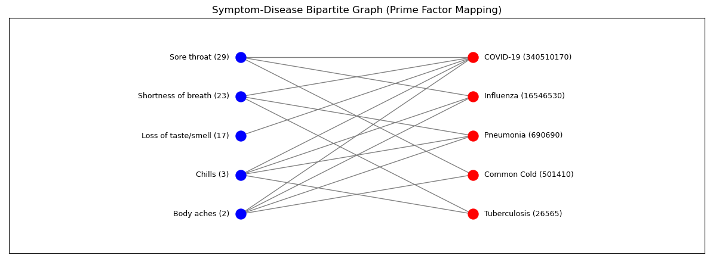

# DolorCor

## Symptom-Disease Prime Mapping

## Overview
This project introduces an elegant and efficient approach to symptom-based disease prediction using **prime factorization** and **bipartite graph representation**. Each symptom is assigned a unique **prime number**, and each disease is represented as a **square-free integer (SQF)**—the product of its associated symptom primes. This allows for **perfect divisibility-based matching** and a visually intuitive graph structure where edges naturally form based on prime factorization.

## Why is this Elegant?
- **Mathematical Purity:** The system leverages prime numbers, ensuring that every symptom-disease relationship is uniquely and deterministically encoded.
- **Perfect Factorization Matching:** If an edge exists between a symptom and a disease, it means the disease's SQF integer is perfectly divisible by the symptom’s prime number.
- **Scalability:** Despite its conceptual depth, the computational complexity remains highly efficient.
- **Graphical Beauty:** The bipartite graph structure **naturally emerges** from number theory, where diseases (right-side nodes) are **composite numbers** made from prime factor symptoms (left-side nodes).

## Features
- **Prime Number-Based Mapping:** Each symptom is assigned a unique prime number.
- **Efficient Disease Representation:** Diseases are stored as SQF integers, making set operations easy and fast.
- **Perfect Matchability:** Checking if a symptom set matches a disease is a simple divisibility test.
- **Bipartite Graph Visualization:** A clear, structured representation of symptom-disease relationships.
- **Interactive CLI Demo:** Users can input symptoms (as primes) and retrieve matching diseases along with graphical output.

## How It Works
1. **Generate Primes:** Assign unique prime numbers to symptoms.
2. **Compute Disease SQFs:** Each disease is assigned an SQF integer based on associated symptom primes.
3. **User Input:** The user enters symptoms, represented by primes.
4. **Matching Algorithm:** The system checks which diseases have SQFs **divisible** by the input primes.
5. **Graph Visualization:** A bipartite graph is drawn with symptom primes on the left and disease SQFs on the right.

## Example
| Symptom       | Prime Number |
|--------------|-------------|
| Fever        | 2           |
| Cough        | 3           |
| Fatigue      | 5           |
| Sore Throat  | 7           |

| Disease       | SQF Integer (Product of Symptom Primes) |
|--------------|----------------------------------|
| Common Cold  | 3 × 7 × 11 = 231               |
| Influenza    | 2 × 3 × 5 × 7 = 210           |
| COVID-19     | 2 × 3 × 5 × 7 × 11 = 2310     |

If the user inputs symptoms with primes `{3, 7}`, the algorithm finds:
- **Common Cold (231) ✅** (divisible by 3, 7)
- **Influenza (210) ✅** (divisible by 3, 7)
- **COVID-19 (2310) ✅** (divisible by 3, 7)

## Visualization Example
The graph below shows how symptom primes (blue) connect to disease SQFs (red) based on divisibility:

## Future Enhancements
- **Database Integration:** Replace hardcoded symptom-disease mapping with a dynamic database.
- **Web Interface:** Create an interactive visualization on a web platform.
- **Machine Learning Integration:** Use ML models alongside prime factorization for enhanced prediction.

## Contributors

<a href="https://github.com/AryaSapkal">

